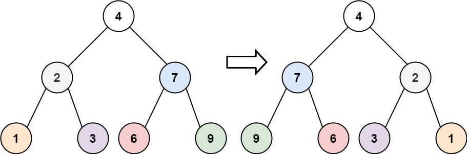

import { Tabs, TabItem } from "@astrojs/starlight/components";

Given the `root` of a binary tree, invert the tree, and return _its root_.

```txt
Input: root = [4,2,7,1,3,6,9]
Output: [4,7,2,9,6,3,1]
```



## Solution

Use a recursive function to invert the tree. The function will swap the left and right child of the current node, and then recursively invert the left and right child nodes.

## Implementation

<Tabs>
  <TabItem label="go">

```go
func invertTree(root *TreeNode) *TreeNode {
  if root == nil {
    return root
  }

  left := invertTree(root.Left)
  right := invertTree(root.Right)

  root.Left = right
  root.Right = left

  return root
}
```

  </TabItem>
  <TabItem label="js">

```js
function invertTree(root) {
  if (root === null) {
    return null;
  }

  const left = invertTree(root.left);
  const right = invertTree(root.right);

  root.left = right;
  root.right = left;

  return root;
}
```

  </TabItem>
  <TabItem label="ts">

```js
function invertTree(root: TreeNode | null): TreeNode | null {
  if (root === null) {
    return null;
  }

  const left = invertTree(root.left);
  const right = invertTree(root.right);

  root.left = right;
  root.right = left;

  return root;
}
```

  </TabItem>
</Tabs>

## Pseudocode

1. If the root is null, return null
2. Recursively invert the left and right child nodes
3. Swap the left and right child nodes
4. Return the root node

## Time & Space Complexity

- Time Complexity: `O(n)` - You need to traverse all the nodes in the tree.
- Space Complexity: `O(n)` - The space used by the call stack during recursion.
