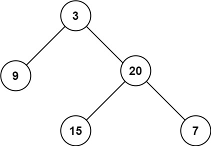

import { Tabs, TabItem } from "@astrojs/starlight/components";

Given the root of a binary tree, return its maximum depth.

A binary tree's maximum depth is the number of nodes along the longest path from the root node down to the farthest leaf node.



The maximum depth of the binary tree in the above image is 3.

## Solution

Use a recursive function to calculate the maximum depth of the tree. The function will return the maximum depth of the left and right child nodes, and then return the maximum of the two plus one.

## Implementation

<Tabs>
  <TabItem label="Python">

```python
# Definition for a binary tree node.
# class TreeNode(object):
#     def __init__(self, val=0, left=None, right=None):
#         self.val = val
#         self.left = left
#         self.right = right

class Solution(object):
    def maxDepth(self, root):
        """
        :type root: TreeNode
        :rtype: int
        """

        if root is None:
            return 0

        return max(self.maxDepth(root.right), self.maxDepth(root.left)) + 1


```

  </TabItem>
</Tabs>

## Pseudocode

1. If the root is `None`, return 0.
2. Return the maximum of the maximum depth of the left and right child nodes plus one.

## Complexity Analysis

- Time Complexity: `O(n)` - because we visit each node exactly once.
- Space Complexity: `O(n)` - in the worst case, the space complexity is `O(n)` due to the recursive call stack.
